# GX Cartório OS — Freshness Firewall

Atualizado em 08/09/2026.

## Problema
Direito notarial e registral é altamente sensível a alterações legislativas, provimentos do CNJ, mudanças no Código Nacional de Normas, atos estaduais e jurisprudência. Um material pode continuar didaticamente excelente e juridicamente perigoso.

O GX deve impedir três falhas:
1. regra revogada/alterada continuar no Material Mestre;
2. questão sintética ser gerada a partir de fundamento vencido;
3. revisão do aluno reforçar conhecimento que deixou de ser válido.

## Princípio
**Atualização não é clipping. É propagação de impacto.**

Uma mudança jurídica só está processada quando o sistema sabe:
- qual fonte mudou;
- desde quando;
- o que ela substitui/altera;
- quais nós do currículo são afetados;
- quais páginas MASTER/REVIEW/RECALL/EXAM derivam daqueles nós;
- quais questões oficiais viraram históricas/desatualizadas;
- quais questões sintéticas precisam ser invalidadas ou regeneradas;
- se o aluno precisa de revisão corretiva.

## Hierarquia de autoridade
1. Constituição e legislação oficial;
2. CNJ/Corregedoria Nacional e atos oficiais competentes;
3. STF/STJ e tribunal competente;
4. edital, prova e gabarito oficiais;
5. doutrina qualificada;
6. curso/material preparatório;
7. comentários, blogs e plataformas de questões.

Uma fonte de nível inferior pode detectar uma mudança, mas não canonizá-la sozinha.

## Estados de freshness
### HOT
Fonte/material com alta volatilidade ou alterado recentemente. Requer conferência frequente e antes de uso sensível.

### Atual
Verificado contra autoridade adequada e sem sinal material de alteração posterior.

### Revalidar
Passou do horizonte de confiança, há notícia de mudança ou depende de norma que foi alterada. Não deve alimentar questão sintética nem afirmação categórica até nova checagem.

### Histórico
Útil para analisar prova/banca/evolução, mas não representa necessariamente o direito vigente.

## Pipeline de mudança

```mermaid
flowchart LR
A["Radar detecta mudança"] --> B["Confirmar fonte oficial"]
B --> C["Registrar ato e vigência"]
C --> D["Mapear nós afetados"]
D --> E["Buscar derivados"]
E --> F["Marcar bloqueio/revalidação"]
F --> G["Atualizar MASTER/REVIEW"]
G --> H["Revisar RECALL/EXAM"]
H --> I["Gerar delta para o aluno"]
I --> J["Nova evidência de domínio"]
```

## Regras de segurança
- Material externo nunca é fonte canônica de vigência.
- Questão oficial antiga é preservada, mas recebe contexto temporal quando a resposta jurídica mudou.
- Questão sintética exige todos os fundamentos em estado Atual/HOT validado.
- Se houver controvérsia real, o material deve registrá-la; não escolher silenciosamente uma posição.
- Se o edital usar marco temporal normativo próprio, a prova-alvo mantém um snapshot distinto do direito corrente.

## Snapshot de prova
O sistema deve distinguir:
- **Direito vigente hoje**;
- **Direito cobrável na prova**, conforme regra temporal do edital;
- **Direito vigente quando uma questão histórica foi aplicada**.

Essa separação é obrigatória para evitar chamar uma questão histórica de “errada” apenas porque a norma mudou depois.

## Impacto no aluno
Mudança relevante pode produzir uma sessão específica de delta:
1. regra antiga recuperada da memória;
2. explicação do que mudou e por quê;
3. contraste antigo × novo;
4. 1–3 recalls;
5. questão nova validada;
6. atualização da evidência de mastery.

## Auditoria periódica
Prioridade de revalidação é função de:
- volatilidade do tema;
- proximidade de prova;
- impacto classificatório;
- existência de alteração recente;
- quantidade de materiais/questões derivados;
- última verificação.

## Evidência empírica de necessidade
A auditoria de mercado encontrou materiais publicamente acessíveis de preparatórios fortes ainda descrevendo estruturas normativas anteriores. Isso não desqualifica o fornecedor; demonstra que um acervo grande inevitavelmente contém artefatos históricos. O GX deve saber a diferença entre **bom conteúdo** e **conteúdo atualmente válido**.